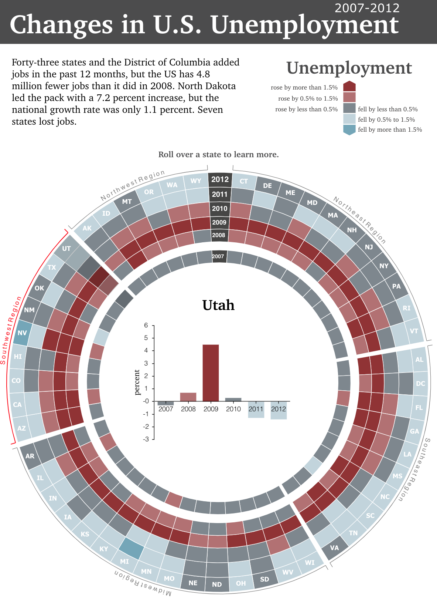

## Interactive visual analytics using Sencha Charts

Presentation slides: `Presentation.pdf`

The original Adobe Flash inforgraphic made by Carla Uriona: `CircleGraph_V3.swf`

To run the examples please use the following URL syntax:

```
index.html?id=infographic_1
index.html?id=infographic_2
...
index.html?id=infographic_10
```

Each example is a step towards creating the final version of the infographic (step 10):

